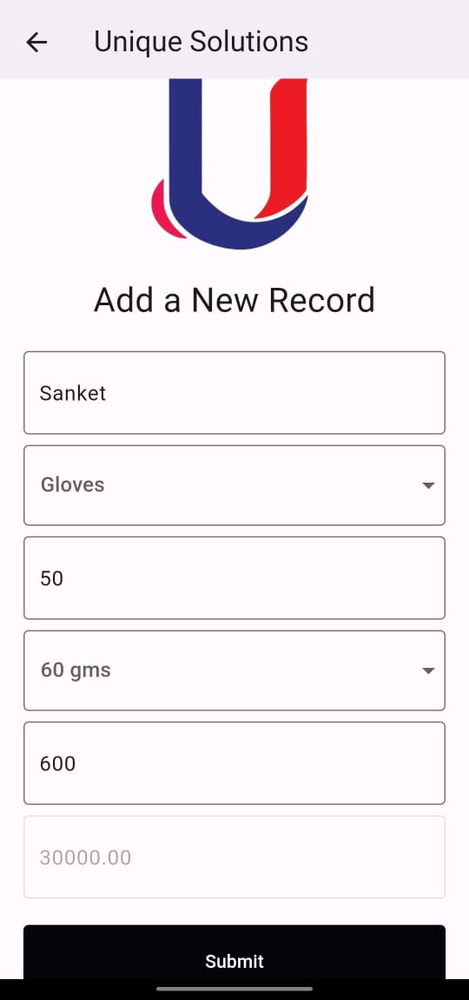
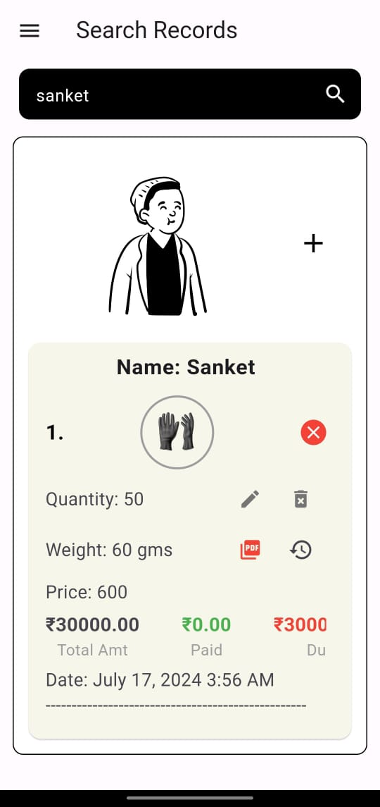
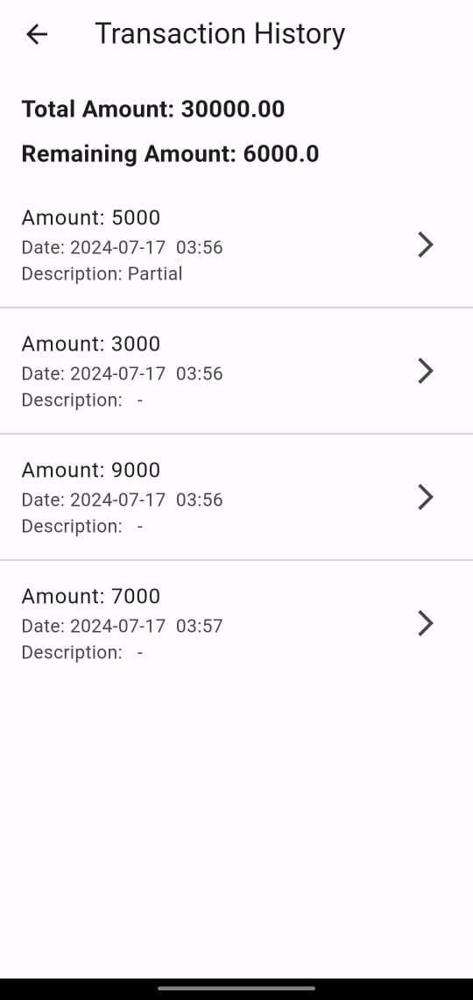
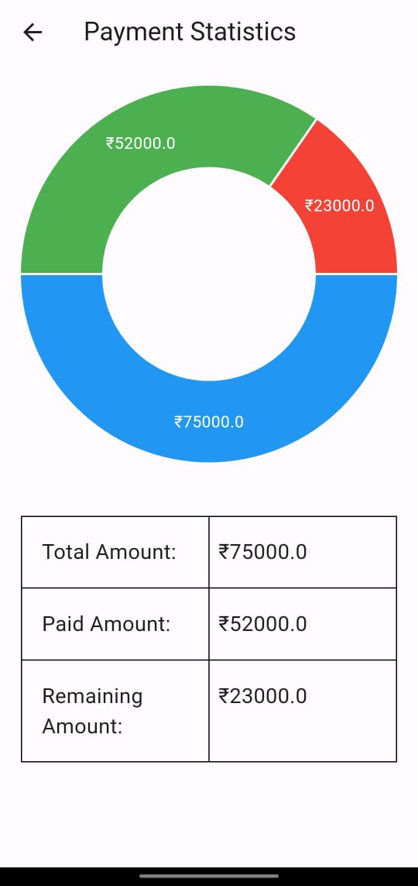

# Unique Solutions Registration and Transaction Management App

<p align="center">
  
</p>


## About the Project

Unique Solutions previously managed registrations and transactions manually, which was time-consuming and prone to errors. An app was needed to efficiently make entries and perform searches to automate and streamline this process. This project addresses these challenges by providing a comprehensive solution for managing records, tracking transactions, and visualizing data.

## Features

### 1. Add Record
This feature allows users to add a new record with the following details:
- **Name:** The name of the individual or entity.
- **Category:** The category of the item (e.g., gloves or cotton).
- **Quantity:** The number of items.
- **Weight:** The weight of the items.
- **Price:** The price per unit.
- **Total Price:** The total price is calculated based on the quantity and price per unit.

### 2. Search for a Particular Record
Users can search for a specific record and perform various actions:
- **View Record:** See the details of the record.
- **Add Payment Amounts:** Add payments to the record.
- **Add Bills:** Attach bills to the record.

### 3. Transaction History
This feature provides a detailed history of all transactions related to a particular record. Users can view the amount, description, date, and time of each transaction.

### 4. Statistics
The app provides statistics on amounts paid, remaining, and total amounts in both pie chart and tabular form. This helps users get a clear overview of their financial status at a glance.

## Installation

To install and run the app locally, follow these steps:

1. Clone the repository:
   ```bash
   git clone https://github.com/yourusername/unique-sol-app.git

2. Navigate to the project directory:
   ```bash
   cd unique-sol-app
   
3. Install dependencies:
   ```bash
   flutter pub get
   
4. Run the app:
   ```bash
   flutter run

## Usage

- **Add Record:** Navigate to the 'Add Record' section and fill in the required details.
- **Search Record:** Use the search bar to find a specific record and manage it.
- **View Transaction History:** Click on the history icon next to a record to view its transaction history.
- **View Statistics:** Navigate to the 'Statistics' section to see the financial overview.

## Screenshots

### Add Record and Search Record
<p align="center">
  
  
</p>

### Transaction History and Statistics
<p align="center">
  
  
</p>

## Contributing

Contributions are welcome! Please open an issue or submit a pull request.

## License

This project is licensed under the MIT License - see the LICENSE file for details.


